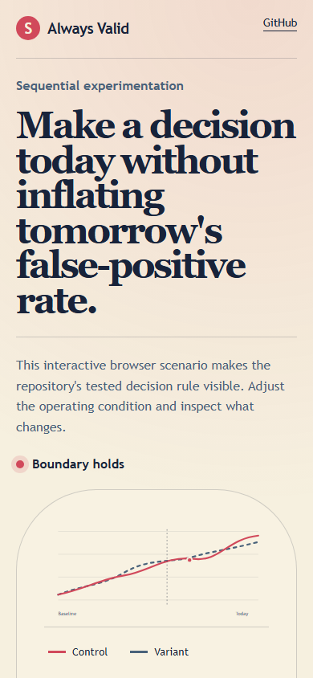

# alwaysvalid

> A sequential A/B calculator that ships the A/A simulation proving why peeking at a fixed-horizon test breaks it.

## Live deployment

[](https://github.com/SlateGitOrg/alwaysvalid/actions/workflows/ci.yml)

[Open the interactive Always Valid demo](https://slategitorg.github.io/alwaysvalid/)

The deployed interface uses a deterministic offline scenario to make the repository's tested decision rule visible without external services or private data.

### Desktop


### Mobile



`COMPACT` · **Marketing Analyst** · Advanced · ~5-6 days · Education - online course conversion testing

**Primary language:** TypeScript
**Tags:** `experimentation`, `statistics`, `sequential-testing`, `msprt`, `static-site`

---

## The problem

Everybody looks at the test dashboard every day and stops the test when it turns green. This inflates the false-positive rate from 5% to well over 30%, meaning roughly one in three shipped 'winning' variants does nothing. Teams then wonder why their compounded 40% of annual lift never shows up in revenue.

## ⭐ The differentiator

Implements **always-valid inference (mSPRT / confidence sequences)**, under which continuous monitoring is legitimate by construction - the interval is valid at every peek. It ships with **the simulation demonstrating the failure it fixes**: 10,000 A/A tests run under fixed-horizon testing with daily peeking, showing the empirical false-positive rate climbing past 30%, beside the same tests under always-valid inference holding at 5%. A generic calculator implements a fixed-horizon z-test and prints a warning about peeking that nobody reads.

This is the sentence to lead with when someone asks you to walk through the
project. Everything else in this repo exists to make it true and to prove it.

## Data

Self-contained simulation. Results validated against published always-valid inference literature.

> No paid API key is required to run or demo this project. Where a paid
> service would add value it is wired as an optional enhancement behind an
> interface with an offline mock as the default implementation.

## Stack

- TypeScript, browser-only (no server - it deploys as a static page)
- Vitest

## Core capabilities

- Always-valid confidence sequences for proportions and for continuous metrics
- Fixed-horizon comparison mode showing both answers side by side
- A/A simulation harness demonstrating empirical false-positive rates for each method
- Sample-size and minimum-detectable-effect planner with a stated evaluation cadence
- Shareable URL encoding a complete test configuration

## Repository layout

```
src/stats/
src/sim/
src/ui/
test/calibration/
```

## Build plan

1. Implement the fixed-horizon test first and build the A/A simulation that breaks it. That chart is the project.
2. Then always-valid inference, and run the identical simulation.
3. Planner and shareable URLs last.
4. Deploy it. A live page is the sixty-second artefact.

## Testing strategy

A 10,000-run A/A simulation asserting the always-valid method holds its false-positive rate at or below 5% under daily peeking **while the fixed-horizon method exceeds 25%**. The test is the argument: it demonstrates both the problem and the fix in one assertion.

Tests assert **correctness**, not merely that the code runs. A green suite on
this repo is a claim about behaviour under adversarial conditions; treat any
test that would pass against a deliberately broken implementation as a bug in
the test.

## Measurable outcome

> A live page showing the two false-positive curves side by side - making an abstract statistical argument land in about eight seconds.

State it in these terms — business units, not technical ones — in your CV
bullet and in the first thirty seconds of describing the project.

## Measured results

Numbers below are produced by `npm run demo` (2,000 simulated A/A experiments,
8% base rate, 2,000 users/day for 21 days, seeded — they reproduce exactly).

| method | process | false-positive rate |
| --- | --- | --- |
| fixed-horizon z-test | looked at once, at the end | 4.5% |
| fixed-horizon z-test | peeked at daily | **24.4%** |
| always-valid (mSPRT) | peeked at daily | 0.3% |

The z-test is not broken — it measures 4.5% against a nominal 5% when used as
designed. The process around it is what fails.

### Two honest caveats

**The always-valid rate is 0.3%, not 5%.** The mixture confidence sequence is
*conservative*: its guarantee is that the error rate never exceeds alpha at any
peek, not that it equals alpha. That conservatism is paid for in power — with a
real 15% lift present, the peeking z-test calls it by a median of day 3 and
always-valid by day 13. The z-test only looks faster because a known share of
those early calls are the false positives in the table above.

**`tau` must be chosen before the experiment.** It is the mixture variance, and
it sets the sample size at which the sequence is tightest (`DEFAULT_TAU =
1.5e-5`, roughly two arms of 10,000 at an 8% base rate). Tuning it after seeing
the data reintroduces exactly the problem this repo exists to demonstrate, one
level up. The implementation takes it as a parameter and documents this rather
than hiding it behind a default.

## Interview questions this project answers

- **What is the peeking problem?**
- **How does mSPRT stay valid under continuous monitoring?**
- **Your PM wants to call the test early. What do you say?**

## What this deliberately is *not*

- Not an experimentation platform. It is the statistics, made undeniable.


## Run it now

```bash
npm test        # runs the suite; no install step needed
npm run demo    # the 60-second artefact
```

Requires Node 22.6+ (24 recommended). TypeScript runs natively via
type stripping - there is no build step and no `node_modules`.

## Getting started

```bash
git clone <your-fork-url> alwaysvalid
cd alwaysvalid
npm install
npm run dev                   # local page
npm run test:calibration      # 10k A/A runs, both methods
npm run build                 # static deploy
```

Docker is supported but optional — every path above works on a plain
Windows/macOS/Linux laptop without a cloud account.

## Definition of done

- [ ] The differentiator above is implemented, and a test proves it
- [ ] The measurable outcome is produced by a command anyone can run
- [ ] `README` explains the one decision a generic version gets wrong
- [ ] CI runs the full suite on every push and is green on `main`
- [ ] A recruiter can see the headline artefact in under 60 seconds

## Licence

MIT — see [LICENSE](LICENSE).
